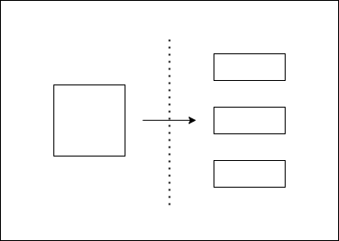
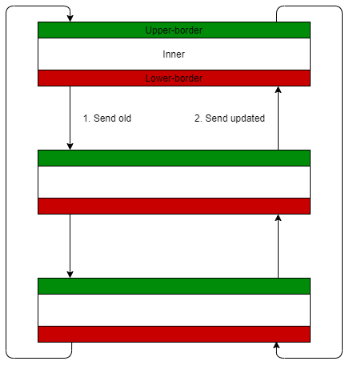
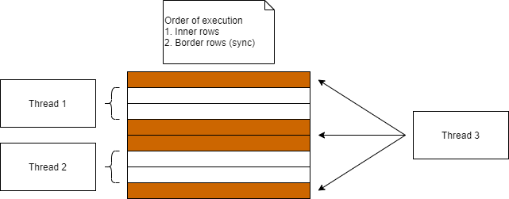

\pagebreak

# Wa-Tor Simulation
Wa-Tor is a predators and prey population simulation.
The planet on which those species live is shaped like a doughnut or torus.
It's normally realized as a two dimensional grid.
Each cell on that grid can contain a fish, shark or just water.
Time passes in chronons.
All animals move during each chronon and if they trespass the grid borders they reappear on the opposite border.
Movement can take place in four directions up, down, left and right.
Sharks must eat fish regularly to survive otherwise they starve.
Fish eat plankton which is assumed to be infinitely available.
Both species breed if certain conditions are met.

## Rules
### Fish
Move to a randomly chosen empty field.
If no field is available they do not move.

Once it survived a certain amount of chronons a new fish is bred to an adjacent cell.

### Sharks
Moves to a surrounding cell that contains a fish.
If no prey is found then a shark moves to an empty field otherwise it does not move.

Each chronon a shark loses energy and dies upon reaching zero.
Sharks gain a fixed amount of energy when eating fish.
Once it survived a certain amount of chronons a new shark is bred to an adjacent cell.
Energy is distributed equally between the current and the new shark.

# General Concept
A two dimensional is used to represent the planet Wa-Tor.
The array stores integer values to represent population.

| Condition | Represented Content |
| --------- | ------------------- |
| cell < 0  | Shark               |
| cell > 0  | Fish                |
| cell = 0  | Water               |

To model energy drain and aging the integer values are increased by one during each chronon.
If a shark's energy increases its energy values moves towards zero (due to being negative) which means it starves.
If a fish's value increases it simply means that it aged by one chronon.

## Why integers?
Prior to using integer values objects were used to represent population.
That led to excessive memory usage.
A 10,000 x 10,000 field filled with animal objects used approximately 4GB of memory.
Switching to integers reduced the memory usage by a factor of ten.

## Parallelization
Geometric decomposition is used to process the field in parallel.
The basic concept of that pattern is to split the field into subfields which are processed in parallel.
It cannot be naively parallelized because the decisions of animals in subfield borders can affect other subfields.
We decided to use a simple solution in which we divide the field by rows.
By using this approach only two borders per subfield must be synchronized.

# MPI Concept

The master process assigns each worker process including itself a subfield.
The first step is to calculate the local inner field.
Then the local version of the last two rows are sent to the next worker
which uses the information to calculate its upper border and sends back the result.
The last two rows are sent because animals on the border can move backwards to the inner field.

## Communication
The send and receive methods block code execution until the transmission is completed.
It was a challenge to implement the communication so that no deadlocks are produced.
That is because it is not easy to properly debug multi-process programs.
Another problem that occurred during implementation was that efficient data-structures such as "Memory2D" do not feature the "Serializable" attribute.
In consequence we were not able to use it as MPI is not able to de/serialize it. 

\pagebreak
# Multithreading Concept

At the program start the field is split into sections and each thread is responsible for one section.
Similar to the MPI concept each inner sub section is processed in parallel.
Then the borders are calculated within their own thread.

## Coordination
We had less challenge in the multithreading solution.
That is due to the missing communication overhead, no deadlocks and easier debugging.
Provided methods of the "System.Threading.Tasks.Parallel" namespace such as "Parallel.For(...)" kept the implementation simple.